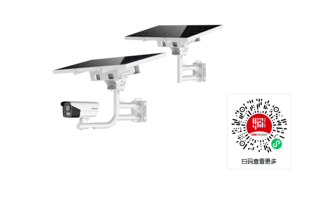
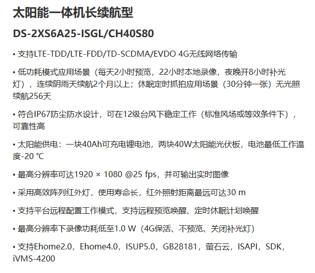
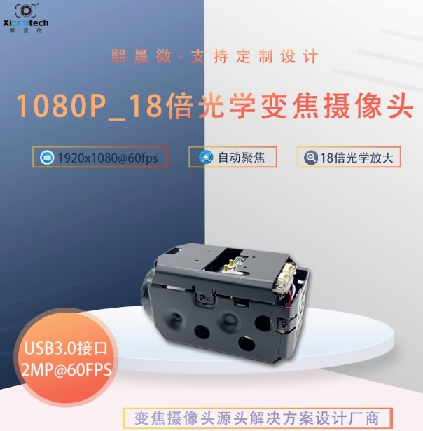
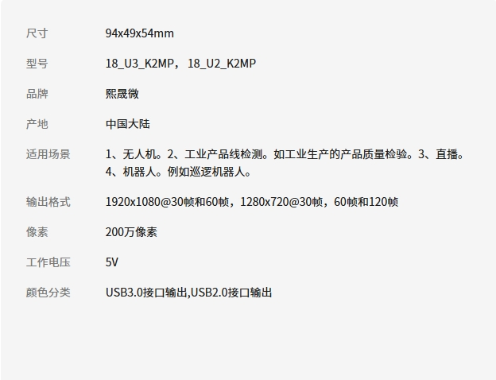
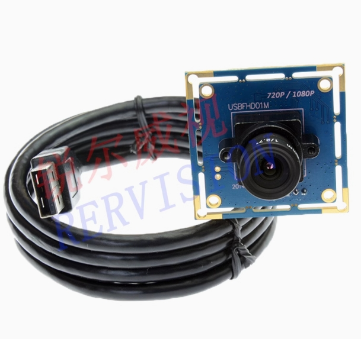
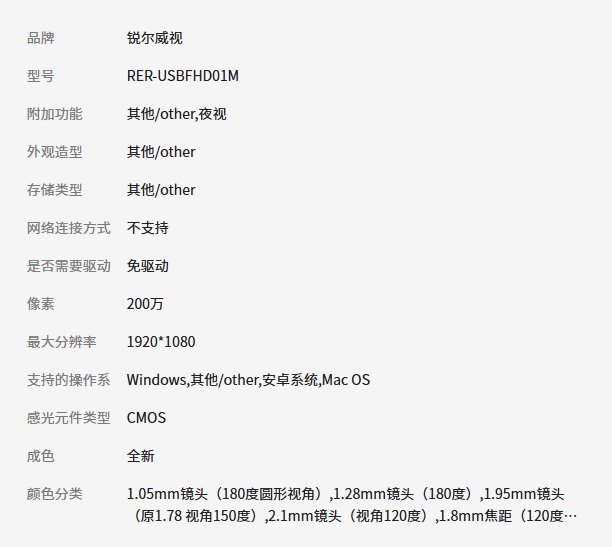

# 危险情况监控系统设计

目录：

- [总体设计](#总体设计)
- [所需设备](#所需设备)

## 总体设计

系统总体上分为图像处理模块、数据传输模块和显示模块。

### 图像处理模块

该模块由摄像头、转发服务器和处理服务器阵列。

- 摄像头应当支持一定程度上的变焦功能，并能够根据接受的指令自动变焦。
- 摄像头通过USB数据线有线连接到转发服务器。
- 转发服务器负责监控处理服务器阵列的运行状况，并将待处理的图像转发给处理服务器阵列。
- 转发服务器与所有处理服务器通过有线连接构成计算机网络，使用星形拓扑，可以直接使用集线器进行组网，转发服务器为中心。只要至少还有一个处理服务器正常运行，就不影响系统的正常运行。但该设计要求转发服务器具有高可靠性。
- 转发服务器和处理服务器使用TCP协议进行连接。
- 处理服务器阵列为一主多备架构。当前正在负责图像处理任务的服务器为主服务器，其余为备用服务器。所有处理服务器均需要定时与转发服务器通信，以告知转发服务器每个处理服务器的存活状态。当主处理服务器崩溃时，转发服务器发现通信连接丢失，自动启用一个备用服务器作为主服务器。崩溃的主服务器应当自行尝试重启并尝试与转发服务器建立连接。
- 处理服务器使用深度学习技术，对接收到的图像进行检测。如果发现存在危险，则控制摄像头进行变焦，拍摄出更为清晰的危险画面。如已经达到摄像头变焦极限，则自动对危险区域进行裁剪，并将结果通过数据传输模块发送到显示模块。发送的具体协议根据显示屏支持的协议类型确定，一般是HTTP协议。

### 数据传输模块

该模块由多个WiFi中继器构成。

- 通过利用WiFi中继器扩大无线网络范围。
- WiFi中继器应当构成环形拓扑，以增强网络可靠性：当任何一个中继器崩溃时，仍不影响系统正常运行。

### 显示模块

该模块包括一块显示屏。

- 显示屏应当自带创建WiFi的功能。系统中所有的设备均直接或间接地连接到显示屏创建的WiFi中。
- 显示屏应当支持一些协议，以接收处理服务器的处理结果并进行显示。

## 所需设备

### 摄像头

#### 1. 海康威视 DS-2XS6A25-ISGL/CH40S80（￥4315）
[产品链接](https://item.taobao.com/item.htm?from=cart&id=743196454162&skuId=5127299961563&spm=a1z0d.6639537%2F202410.item.d743196454162.5edb7484cQCDbx)

  
  

---

#### 2. 熙晟微摄像头 18_U3_K2MP，18_U2_K2MP（￥700）
[产品链接](https://item.taobao.com/item.htm?from=cart&id=811554043988&skuId=5675817355281&spm=a1z0d.6639537%2F202410.item.d811554043988.7d017484oYLGmO)

  
  

---

#### 3. 锐尔威视 RER-USBFHD01M 8mm版（￥274.4）
[产品链接](https://item.taobao.com/item.htm?from=cart&id=662245508294&skuId=4954748203220&spm=a1z0d.6639537%2F202410.item.d662245508294.c4877484LHLI4i)

  
  

### 转发服务器
- [鲁班猫2](https://detail.tmall.com/item.htm?id=694035121512&pisk=gugISjOZg9XIlI4RNkAaG7RjixaSRC84v_N-ibQFwyUpyaMnGJ7ETbF-PYkTzup384MseY_rY2zU2UeaNgCL2aLT6WVVeu3zU41n5x_P8pxnwaazyKJ2uElHtz4J3nb8oIW3MSWJz8eL6yVPqCxutElnt8fCeIo9u_gh6JXR28H8WlFbOzQRJ7d6WS2OJ7QLyRd_IRFdJwIpWPFbw8B-e7LT67VlvWE8vNUTNRe8yzH-6CNzB8huJsNWAJcBtIre5cb8eXe1ya3BrkwjOg75PVNLAfGLCcoZ5WZQHueLIPgKQb3E-lxNjzcZcYi-EnSgRbnLJSlHRNax9cu7_4RPVJhZ5f3Qxs74A0F7DzE1wah_-JEsRrLAC5mtT03nd__8t2u4V-q6waqzWqrxDv1kifULwYqmzKb3pbhmomzX7MUx10HjVgyfu-i5Mg1_maN_3CO1qgYJsQ0NXRm88kFgOlR619nuv5V_3CO1qgqLsWww1C6Kq&skuId=5629028363502&spm=a1z10.5-b-s.w4004-25031601900.2.60d31514TFHHbW)
### 数据处理服务器
- [鲁班猫4](https://detail.tmall.com/item.htm?id=732375324313&pisk=g7TKR_iMmADnb2YdsBogqRYTTJhiicAF5pRbrTX3Vdp9tKpuxwXHyhd2BX7kEQ6JedXw-XWoT8pJwBICOy6B1C1Fw_NCFQNRNdbC4HXlKTQJaKhinq0DTB7P5xDmoe394dbCO6aCFb11i_cGOANbw-bPPxD8jzsEkaJBvR2YAl11Q_C7d_951N1FC6ZCPL61fs17Ra9WFN_1TsCQF_1W1P6Ngy15dya1C_CbR66BFNGOaO65PM9W1AOneONCEzKVxIylacx8PzTO9GiM9O1dTbfhv5OdCzMX-6UVhB6TPz6A1SbD6BDLuCbeuKCDKVapHI8wB19jyAQyQ395wdg4Ew-DLES9Kma61NWNcOTbdk1AJ9IXRGP8RCsWXFQHRYr2sCBCDNxibvjlJpKV3MiZQLdOKLTdfJHGEnAMRGpjIPpP2nRlwp3LRKszOEYY7I2cH_qI6fEz4M1ZHxfyYb4X3mfOnX384uSZ_1Bm6fEz4M1N6tcKwurPbf5..&skuId=5253458654394&spm=a1z10.5-b-s.w4004-25031601900.6.4f003ca94scd9X)
### WiFi中继器

- [腾达EM3](https://e.tb.cn/h.6jnnBQONlGUJeiK?tk=uDqSVXQgTgA)

### 显示屏

- [CFORCE 15.6寸无线显示屏](https://e.tb.cn/h.6jnqbwEHyEvlHFH?tk=q4D3VXQ7Ako)
- [LED显示屏阵列定制](https://e.tb.cn/h.6jj1kAk0qKPEU3k?tk=FyprVXQ9Xtn)
